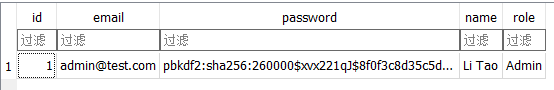
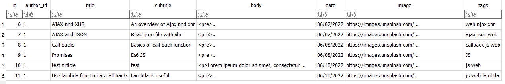

# Li Tao's Portfolio website

This website is live at [http://www.leelee.cc](http://www.leelee.cc). You may go to this URL to have a full demo of the website. 

All assets and source codes are hosted at [https://github.com/taoli24/lee_site](https://github.com/taoli24/lee_site).  

This local version use sqlite as database for storing user and blog posts, in which it has one user (site owner) and 6 articles.  

You may create more articles if you log in with:

* Username: admin@test.com
* Password: 1234567890

The live version uses upgraded postgresql as database, it has been set up with different username and password.

## Purpose 

The purpose of this website is to demonstrate and showcase skills, ability and experience to potential employers.

## DB Structure 

#### users table

#### posts table

## Features and Functionality 

#### Features
* Home page contains some personal info, skills and projects that I have worked in the past.
* Footer contains links to social platform and GitHub
* An interactive canvas element in the hero section on the home page
* Navigation hamburger animated using vanilla CSS and javascript
* Command line animation

#### Functionality
* On initial deployment of the website, the admin user will be set up using API
* Login page for website owner
* Some functions only available to admins such as post new blogs and make changes to blogs.
* Blog posts can be sorted using tags
* Syntax highlighted code snippets

## Sitemap 

## Target audience 

The target audience of the website are potential employers and whoever interested in the blogs content.

## Tech stack used in this project 

 - Html5
 - CSS3
 - Javascript
 - Flask
 - Postgresql
 - Deployed on Heroku

## Screenshots 

#### Home Page

#### Blog list page

#### Login page

#### Make new post page

#### View blog
